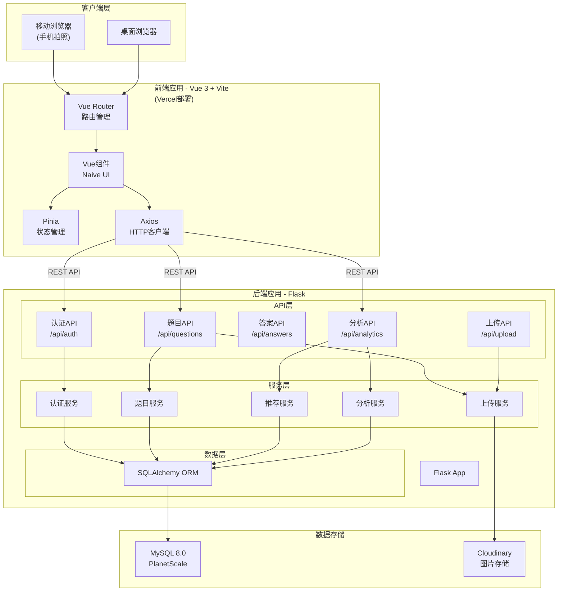
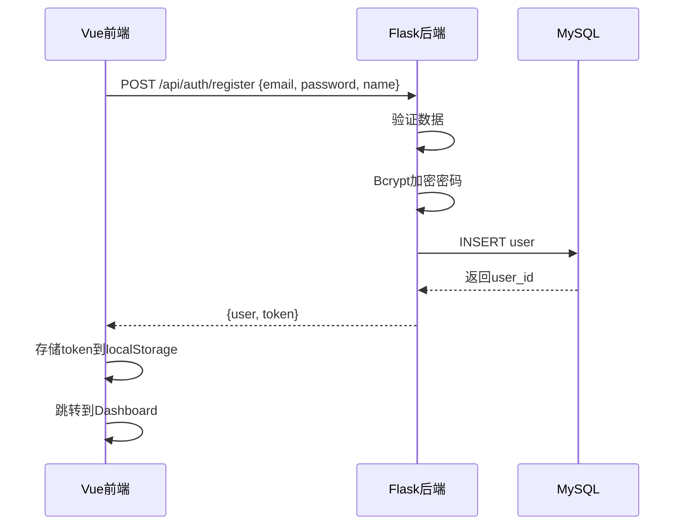
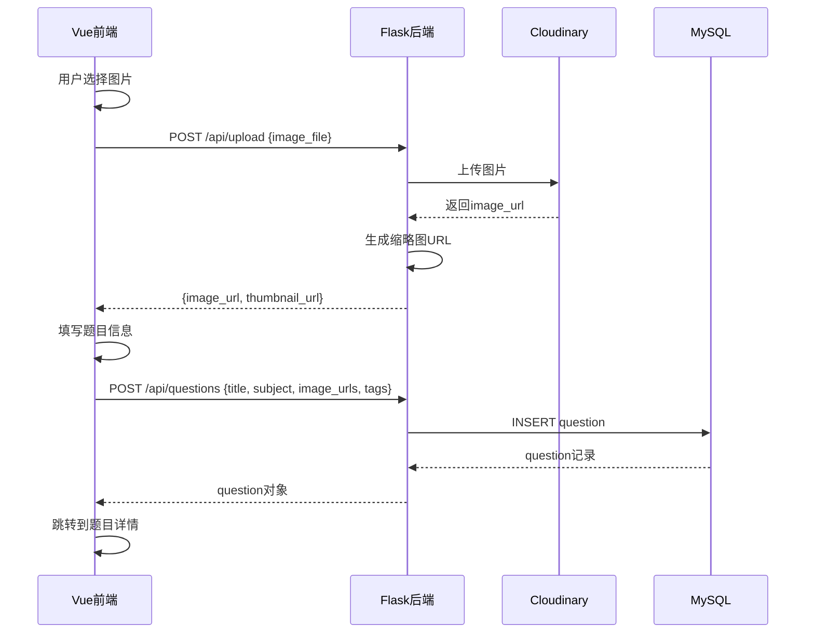

# 系统架构设计 - Flask + Vue 版本

## 1. 最终技术栈

### 1.1 后端技术栈

```python
Framework:        Flask 3.0
ORM:             SQLAlchemy 2.0 + Flask-SQLAlchemy
Database:        MySQL 8.0 (PlanetScale)
Authentication:  Flask-JWT-Extended
API:             Flask-RESTful
Validation:      Marshmallow
Password:        Bcrypt
File Upload:     Cloudinary Python SDK
Migration:       Flask-Migrate (Alembic)
Environment:     python-dotenv
```

### 1.2 前端技术栈

```javascript
Framework:       Vue 3 (Composition API)
Build Tool:      Vite
UI Library:      Naive UI (推荐) 或 Element Plus
State:           Pinia
Router:          Vue Router
HTTP Client:     Axios
Forms:           VeeValidate + Yup
Images:          vue-advanced-cropper
Charts:          Vue-ECharts
Utils:           date-fns, lodash-es
```

### 1.3 数据库

```
Database:        MySQL 8.0
Cloud Provider:  PlanetScale (免费5GB)
Backup:          PlanetScale自动备份
```

### 1.4 文件存储

```
Service:         Cloudinary
Free Tier:       25GB存储, 25GB带宽/月
Image Optimize:  自动压缩和转换
```

### 1.5 部署方案

```
Frontend:        Vercel (免费)
Backend:         Railway (免费$5/月额度) 或 Render
Database:        PlanetScale (免费)
Total Cost:      $0/月 (免费额度内)
```

---

## 2. 系统架构图



---

## 3. 项目结构

### 3.1 后端项目结构 (Flask)

```
backend/
├── app/
│   ├── __init__.py              # Flask应用工厂
│   ├── config.py                # 配置类
│   │
│   ├── models/                  # SQLAlchemy模型
│   │   ├── __init__.py
│   │   ├── user.py             # 用户模型
│   │   ├── question.py         # 题目模型
│   │   ├── answer.py           # 答案模型
│   │   ├── comment.py          # 评论模型
│   │   └── study_stats.py      # 学习统计模型
│   │
│   ├── schemas/                 # Marshmallow序列化
│   │   ├── __init__.py
│   │   ├── user_schema.py
│   │   ├── question_schema.py
│   │   └── answer_schema.py
│   │
│   ├── routes/                  # API路由(蓝图)
│   │   ├── __init__.py
│   │   ├── auth.py             # POST /api/auth/register, /login
│   │   ├── questions.py        # CRUD /api/questions
│   │   ├── answers.py          # CRUD /api/answers
│   │   ├── analytics.py        # GET /api/analytics/*
│   │   ├── upload.py           # POST /api/upload
│   │   └── users.py            # GET /api/users/profile
│   │
│   ├── services/                # 业务逻辑层
│   │   ├── __init__.py
│   │   ├── auth_service.py
│   │   ├── question_service.py
│   │   ├── recommendation_service.py
│   │   ├── upload_service.py
│   │   └── analytics_service.py
│   │
│   └── utils/                   # 工具函数
│       ├── __init__.py
│       ├── decorators.py       # 自定义装饰器
│       ├── validators.py       # 验证器
│       └── helpers.py          # 辅助函数
│
├── migrations/                  # 数据库迁移文件
│   └── versions/
│
├── tests/                       # 测试文件
│   ├── test_auth.py
│   ├── test_questions.py
│   └── test_services.py
│
├── .env                         # 环境变量(不提交)
├── .env.example                 # 环境变量示例
├── requirements.txt             # Python依赖
├── run.py                       # 应用入口
└── README.md
```

### 3.2 前端项目结构 (Vue)

```
frontend/
├── src/
│   ├── api/                     # API调用
│   │   ├── client.js           # Axios配置
│   │   ├── auth.js             # 认证API
│   │   ├── questions.js        # 题目API
│   │   ├── answers.js          # 答案API
│   │   └── analytics.js        # 分析API
│   │
│   ├── assets/                  # 静态资源
│   │   ├── images/
│   │   └── styles/
│   │       └── main.css
│   │
│   ├── components/              # Vue组件
│   │   ├── common/             # 通用组件
│   │   │   ├── AppHeader.vue
│   │   │   ├── AppSidebar.vue
│   │   │   └── LoadingSpinner.vue
│   │   │
│   │   ├── questions/          # 题目相关组件
│   │   │   ├── QuestionCard.vue
│   │   │   ├── QuestionList.vue
│   │   │   ├── QuestionUpload.vue
│   │   │   ├── QuestionDetail.vue
│   │   │   └── QuestionFilters.vue
│   │   │
│   │   └── dashboard/          # Dashboard组件
│   │       ├── StatsCard.vue
│   │       ├── RecommendationList.vue
│   │       └── ProgressChart.vue
│   │
│   ├── composables/            # Vue组合式函数
│   │   ├── useAuth.js
│   │   ├── useQuestions.js
│   │   └── useUpload.js
│   │
│   ├── layouts/                # 布局组件
│   │   ├── DefaultLayout.vue
│   │   └── AuthLayout.vue
│   │
│   ├── router/                 # Vue Router配置
│   │   └── index.js
│   │
│   ├── stores/                 # Pinia状态管理
│   │   ├── auth.js
│   │   ├── questions.js
│   │   └── ui.js
│   │
│   ├── views/                  # 页面组件
│   │   ├── auth/
│   │   │   ├── LoginView.vue
│   │   │   └── RegisterView.vue
│   │   ├── dashboard/
│   │   │   └── DashboardView.vue
│   │   ├── questions/
│   │   │   ├── QuestionListView.vue
│   │   │   ├── QuestionDetailView.vue
│   │   │   └── QuestionUploadView.vue
│   │   └── subjects/
│   │       ├── ReadingView.vue
│   │       ├── WritingView.vue
│   │       ├── MathsView.vue
│   │       └── ThinkingView.vue
│   │
│   ├── utils/                  # 工具函数
│   │   ├── constants.js
│   │   ├── formatters.js
│   │   └── validators.js
│   │
│   ├── App.vue                 # 根组件
│   └── main.js                 # 入口文件
│
├── public/
│   └── favicon.ico
│
├── index.html
├── package.json
├── vite.config.js
├── tailwind.config.js
└── README.md
```

---

## 4. 核心代码示例

### 4.1 Flask后端

#### Flask应用工厂
```python
# app/__init__.py
from flask import Flask
from flask_sqlalchemy import SQLAlchemy
from flask_migrate import Migrate
from flask_jwt_extended import JWTManager
from flask_cors import CORS
from flask_marshmallow import Marshmallow
from app.config import Config

db = SQLAlchemy()
migrate = Migrate()
jwt = JWTManager()
ma = Marshmallow()

def create_app(config_class=Config):
    app = Flask(__name__)
    app.config.from_object(config_class)
    
    # 初始化扩展
    db.init_app(app)
    migrate.init_app(app, db)
    jwt.init_app(app)
    ma.init_app(app)
    
    # CORS配置
    CORS(app, resources={
        r"/api/*": {
            "origins": app.config['CORS_ORIGINS'],
            "methods": ["GET", "POST", "PUT", "DELETE", "PATCH"],
            "allow_headers": ["Content-Type", "Authorization"]
        }
    })
    
    # 注册蓝图
    from app.routes import auth, questions, answers, analytics, upload, users
    app.register_blueprint(auth.bp)
    app.register_blueprint(questions.bp)
    app.register_blueprint(answers.bp)
    app.register_blueprint(analytics.bp)
    app.register_blueprint(upload.bp)
    app.register_blueprint(users.bp)
    
    return app
```

#### SQLAlchemy模型示例
```python
# app/models/question.py
from app import db
from datetime import datetime
import json

class Question(db.Model):
    __tablename__ = 'questions'
    
    id = db.Column(db.String(36), primary_key=True)
    title = db.Column(db.String(255))
    
    # MVP: 使用String而非Enum，支持未来自定义科目扩展
    # 当前值: 'READING', 'WRITING', 'MATHS', 'THINKING_SKILLS'
    # 未来可扩展: 'PIANO', 'HSC_PHYSICS', 自定义科目名称等
    subject = db.Column(db.String(50), nullable=False, index=True)
    
    # MVP: 简化版 - 图片数组
    # 未来扩展：见 docs/11-flexible-content-design.md 的 content JSON 方案
    image_urls = db.Column(db.JSON)  # ["url1.jpg", "url2.jpg"]
    thumbnail_urls = db.Column(db.JSON)
    tags = db.Column(db.JSON)  # ["algebra", "equations"]
    
    difficulty = db.Column(db.Integer, default=3)
    
    # 使用String而非Enum，提供更大灵活性
    status = db.Column(db.String(50), default='UNANSWERED')
    # 值: 'UNANSWERED', 'ANSWERED', 'MASTERED', 'NEED_REVIEW'
    
    is_difficult = db.Column(db.Boolean, default=False)
    is_frequent = db.Column(db.Boolean, default=False)
    
    view_count = db.Column(db.Integer, default=0)
    answer_count = db.Column(db.Integer, default=0)
    correct_count = db.Column(db.Integer, default=0)
    
    user_id = db.Column(db.String(36), db.ForeignKey('users.id'), nullable=False, index=True)
    
    created_at = db.Column(db.DateTime, default=datetime.utcnow, index=True)
    updated_at = db.Column(db.DateTime, default=datetime.utcnow, onupdate=datetime.utcnow)
    
    # 关系
    answers = db.relationship('Answer', back_populates='question',cascade='all, delete-orphan')
    comments = db.relationship('Comment', back_populates='question', cascade='all, delete-orphan')
    
    def to_dict(self):
        return {
            'id': self.id,
            'title': self.title,
            'subject': self.subject,
            'image_urls': self.image_urls,
            'thumbnail_urls': self.thumbnail_urls,
            'tags': self.tags,
            'difficulty': self.difficulty,
            'status': self.status,
            'is_difficult': self.is_difficult,
            'is_frequent': self.is_frequent,
            'view_count': self.view_count,
            'answer_count': self.answer_count,
            'correct_count': self.correct_count,
            'user_id': self.user_id,
            'created_at': self.created_at.isoformat(),
            'updated_at': self.updated_at.isoformat()
        }
```

#### API路由示例
```python
# app/routes/questions.py
from flask import Blueprint, request, jsonify
from flask_jwt_extended import jwt_required, get_jwt_identity
from app.services.question_service import QuestionService

bp = Blueprint('questions', __name__, url_prefix='/api/questions')

@bp.route('', methods=['GET'])
@jwt_required()
def get_questions():
    """获取题目列表"""
    user_id = get_jwt_identity()
    
    # 查询参数
    params = {
        'subject': request.args.get('subject'),
        'difficulty': request.args.get('difficulty', type=int),
        'status': request.args.get('status'),
        'is_difficult': request.args.get('is_difficult', type=bool),
        'is_frequent': request.args.get('is_frequent', type=bool),
        'page': request.args.get('page', 1, type=int),
        'per_page': request.args.get('per_page', 20, type=int)
    }
    
    result = QuestionService.get_questions(user_id, params)
    return jsonify(result), 200

@bp.route('', methods=['POST'])
@jwt_required()
def create_question():
    """创建新题目"""
    user_id = get_jwt_identity()
    data = request.get_json()
    
    question = QuestionService.create_question(user_id, data)
    return jsonify(question.to_dict()), 201

@bp.route('/<question_id>', methods=['GET'])
@jwt_required()
def get_question(question_id):
    """获取题目详情"""
    question = QuestionService.get_question_by_id(question_id)
    return jsonify(question.to_dict()), 200
```

### 4.2 Vue前端

#### Axios客户端配置
```javascript
// src/api/client.js
import axios from 'axios'
import { useAuthStore } from '@/stores/auth'
import router from '@/router'

const apiClient = axios.create({
  baseURL: import.meta.env.VITE_API_URL || 'http://localhost:5000/api',
  headers: {
    'Content-Type': 'application/json'
  }
})

// 请求拦截器
apiClient.interceptors.request.use(
  (config) => {
    const authStore = useAuthStore()
    if (authStore.token) {
      config.headers.Authorization = `Bearer ${authStore.token}`
    }
    return config
  },
  (error) => Promise.reject(error)
)

// 响应拦截器
apiClient.interceptors.response.use(
  (response) => response,
  (error) => {
    if (error.response?.status === 401) {
      const authStore = useAuthStore()
      authStore.logout()
      router.push('/login')
    }
    return Promise.reject(error)
  }
)

export default apiClient
```

#### Pinia Store示例
```javascript
// src/stores/questions.js
import { defineStore } from 'pinia'
import { questionAPI } from '@/api/questions'

export const useQuestionStore = defineStore('questions', {
  state: () => ({
    questions: [],
    currentQuestion: null,
    filters: {
      subject: '',
      difficulty: null,
      status: ''
    },
    pagination: {
      page: 1,
      perPage: 20,
      total: 0
    },
    loading: false
  }),

  actions: {
    async fetchQuestions() {
      this.loading = true
      try {
        const params = {
          ...this.filters,
          page: this.pagination.page,
          per_page: this.pagination.perPage
        }
        const response = await questionAPI.getQuestions(params)
        this.questions = response.data.questions
        this.pagination.total = response.data.total
      } catch (error) {
        console.error('Failed to fetch questions:', error)
        throw error
      } finally {
        this.loading = false
      }
    },

    async createQuestion(data) {
      const response = await questionAPI.createQuestion(data)
      this.questions.unshift(response.data)
      return response.data
    },

    setFilters(filters) {
      this.filters = { ...this.filters, ...filters }
      this.pagination.page = 1
      this.fetchQuestions()
    }
  }
})
```

#### Vue组件示例
```vue
<!-- src/views/questions/QuestionListView.vue -->
<template>
  <div class="question-list-view">
    <div class="header">
      <h1>我的题目</h1>
      <n-button type="primary" @click="$router.push('/questions/upload')">
        <template #icon>
          <n-icon><Upload /></n-icon>
        </template>
        上传题目
      </n-button>
    </div>

    <!-- 筛选器 -->
    <div class="filters">
      <n-select
        v-model:value="filters.subject"
        :options="subjectOptions"
        placeholder="选择科目"
        clearable
        @update:value="handleFilterChange"
      />
      <n-select
        v-model:value="filters.difficulty"
        :options="difficultyOptions"
        placeholder="选择难度"
        clearable
        @update:value="handleFilterChange"
      />
    </div>

    <!-- 题目列表 -->
    <n-spin :show="questionStore.loading">
      <div v-if="questionStore.questions.length" class="question-grid">
        <QuestionCard
          v-for="question in questionStore.questions"
          :key="question.id"
          :question="question"
        />
      </div>
      <n-empty v-else description="还没有题目，赶快上传吧！" />
    </n-spin>

    <!-- 分页 -->
    <n-pagination
      v-model:page="pagination.page"
      :page-count="totalPages"
      @update:page="handlePageChange"
    />
  </div>
</template>

<script setup>
import { ref, computed, onMounted } from 'vue'
import { useQuestionStore } from '@/stores/questions'
import QuestionCard from '@/components/questions/QuestionCard.vue'
import { Upload } from '@vicons/ionicons5'

const questionStore = useQuestionStore()

const filters = ref({
  subject: '',
  difficulty: null
})

const pagination = computed(() => questionStore.pagination)
const totalPages = computed(() => 
  Math.ceil(pagination.value.total / pagination.value.perPage)
)

const subjectOptions = [
  { label: 'Reading', value: 'READING' },
  { label: 'Writing', value: 'WRITING' },
  { label: 'Maths', value: 'MATHS' },
  { label: 'Thinking Skills', value: 'THINKING_SKILLS' }
]

const difficultyOptions = [
  { label: '⭐', value: 1 },
  { label: '⭐⭐', value: 2 },
  { label: '⭐⭐⭐', value: 3 },
  { label: '⭐⭐⭐⭐', value: 4 },
  { label: '⭐⭐⭐⭐⭐', value: 5 }
]

const handleFilterChange = () => {
  questionStore.setFilters(filters.value)
}

const handlePageChange = (page) => {
  questionStore.pagination.page = page
  questionStore.fetchQuestions()
}

onMounted(() => {
  questionStore.fetchQuestions()
})
</script>

<style scoped>
.question-list-view {
  padding: 24px;
}

.header {
  display: flex;
  justify-content: space-between;
  align-items: center;
  margin-bottom: 24px;
}

.filters {
  display: flex;
  gap: 16px;
  margin-bottom: 24px;
}

.question-grid {
  display: grid;
  grid-template-columns: repeat(auto-fill, minmax(300px, 1fr));
  gap: 24px;
  margin-bottom: 24px;
}
</style>
```

---

## 5. 数据流设计

### 5.1 用户认证流程



### 5.2 题目上传流程



---

## 6. 部署架构

### 6.1 开发环境

```
┌─────────────────────┐
│  localhost:5173     │  Vue Dev Server (Vite)
│  (Frontend)         │
└──────────┬──────────┘
           │ HTTP API
           ↓
┌─────────────────────┐
│  localhost:5000     │  Flask Dev Server
│  (Backend)          │
└──────────┬──────────┘
           │
           ↓
┌─────────────────────┐
│  PlanetScale        │  MySQL Database
│  (Cloud)            │
└─────────────────────┘
```

### 6.2 生产环境

```
┌─────────────────────┐
│  Vercel CDN         │  Vue Production Build
│  app.example.com    │
└──────────┬──────────┘
           │ HTTPS REST API
           ↓
┌─────────────────────┐
│  Railway            │  Flask Production (Gunicorn)
│  api.example.com    │
└──────────┬──────────┘
           │
           ↓
┌─────────────────────┐
│  PlanetScale        │  MySQL Database (Production)
│  (Cloud)            │
└─────────────────────┘
```

---

## 7. 安全设计

### 7.1 认证与授权
- JWT Token认证
- Token存储在localStorage
- 每个API请求携带Bearer Token
- Token过期自动跳转登录

### 7.2 CORS配置
```python
# Flask CORS配置
CORS(app, resources={
    r"/api/*": {
        "origins": ["https://app.example.com"],  # 生产环境
        # "origins": ["http://localhost:5173"],  # 开发环境
        "methods": ["GET", "POST", "PUT", "DELETE", "PATCH"],
        "allow_headers": ["Content-Type", "Authorization"]
    }
})
```

### 7.3 输入验证
- 后端：Marshmallow Schema验证
- 前端：VeeValidate + Yup验证
- 双重验证确保数据安全

---

## 8. 性能优化

### 8.1 后端优化
- SQLAlchemy查询优化（避免N+1）
- 分页查询（限制每页数量）
- 数据库索引（user_id, subject, created_at等）

### 8.2 前端优化
- Vite构建优化（代码分割）
- 图片懒加载
- 组件懒加载
- Pinia状态缓存

---

## 9. 开发工具

### 9.1 后端开发
```bash
# 虚拟环境
python -m venv venv
source venv/bin/activate  # Windows: venv\Scripts\activate

# 安装依赖
pip install -r requirements.txt

# 数据库迁移
flask db upgrade

# 运行开发服务器
flask run --debug
```

### 9.2 前端开发
```bash
# 安装依赖
npm install

# 运行开发服务器
npm run dev

# 构建生产版本
npm run build
```

---

## 10. 监控与日志

### 10.1 后端日志
```python
import logging

logging.basicConfig(
    level=logging.INFO,
    format='%(asctime)s - %(name)s - %(levelname)s - %(message)s'
)
```

### 10.2 错误追踪
- 开发环境：Flask Debug模式
- 生产环境：Sentry集成（可选）

---

**完整技术栈总结**:
- **后端**: Flask + SQLAlchemy + MySQL
- **前端**: Vue 3 + Vite + Naive UI
- **部署**: Vercel + Railway + PlanetScale
- **成本**: $0/月（免费额度内）
