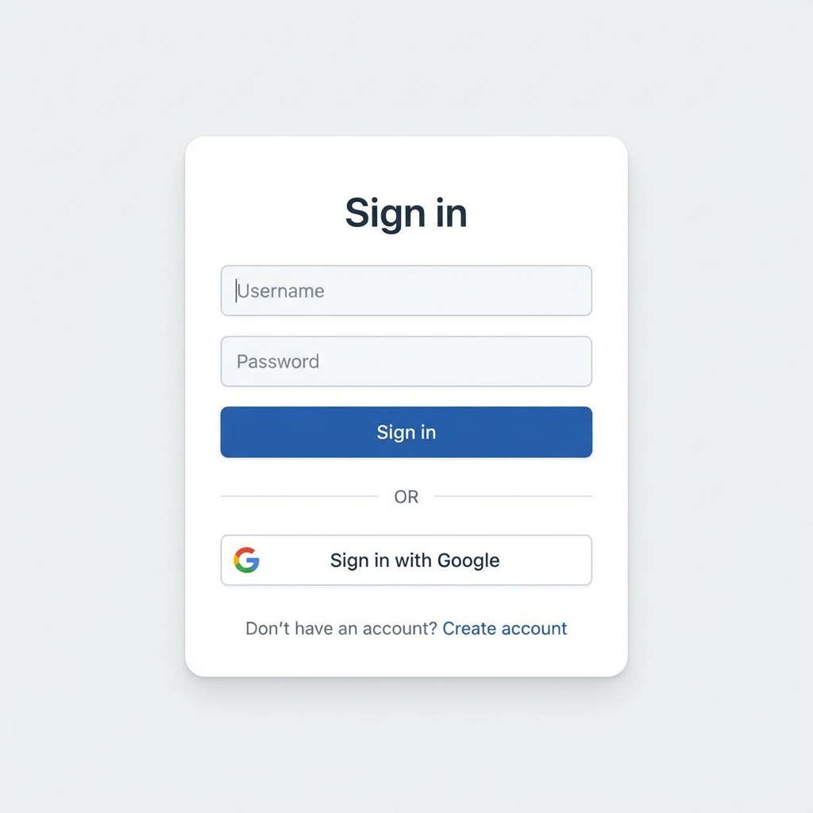

# Google OAuth Login - Implementation Plan

## Goal

Add "Sign in with Google" functionality to allow users to authenticate using their Google account **alongside** existing username/password authentication. The existing email/password sign-up and sign-in will continue to work unchanged.

---

## UI Preview

The updated login page will look like this:



**Key Elements:**
- Existing username/password form (unchanged)
- "OR" divider
- Google Sign-In button below

---

## Database Changes

### User Model
Add fields to support OAuth providers while keeping existing password auth:

```python
# app/models/user.py
class User(db.Model):
    # Existing fields (unchanged)
    id = db.Column(db.Integer, primary_key=True)
    username = db.Column(db.String(64), unique=True, nullable=False)
    email = db.Column(db.String(120), unique=True, nullable=False)
    password_hash = db.Column(db.String(256), nullable=True)  # Now nullable for OAuth users
    role = db.Column(db.String(20), default='student')
    created_at = db.Column(db.DateTime, default=datetime.utcnow)
    
    # New OAuth fields
    google_id = db.Column(db.String(100), unique=True, nullable=True, index=True)
    auth_provider = db.Column(db.String(20), default='local', nullable=False)  # 'local', 'google'
    avatar_url = db.Column(db.String(500), nullable=True)  # Profile picture from Google
```

### Migration (Complete)

```python
def upgrade():
    # Add new columns with proper defaults
    op.add_column('users', sa.Column('google_id', sa.String(100), nullable=True))
    op.add_column('users', sa.Column('auth_provider', sa.String(20), nullable=False, server_default='local'))
    op.add_column('users', sa.Column('avatar_url', sa.String(500), nullable=True))
    
    # Add unique index for google_id
    op.create_index('ix_users_google_id', 'users', ['google_id'], unique=True)
    
    # Make password_hash nullable (existing users already have values)
    op.alter_column('users', 'password_hash', nullable=True, existing_type=sa.String(256))
    
    # Backfill: ensure all existing users have auth_provider='local'
    op.execute("UPDATE users SET auth_provider = 'local' WHERE auth_provider IS NULL")


def downgrade():
    op.drop_index('ix_users_google_id', 'users')
    op.drop_column('users', 'avatar_url')
    op.drop_column('users', 'auth_provider')
    op.drop_column('users', 'google_id')
    op.alter_column('users', 'password_hash', nullable=False, existing_type=sa.String(256))
```

---

## Backend API Changes

### Existing Endpoints (Unchanged)
- `POST /api/auth/register` - Username/password registration ✅
- `POST /api/auth/login` - Username/password login ✅ (with additional checks below)
- `GET /api/auth/me` - Get current user ✅

### Modified: `POST /api/auth/login`

Handle Google-only accounts gracefully:

```python
@bp.route('/login', methods=['POST'])
def login():
    data = request.get_json()
    # ... existing validation ...
    
    user = User.query.filter_by(username=data['username']).first()
    
    if not user:
        return jsonify({'error': 'Invalid username or password'}), 401
    
    # Block password login for Google-only users
    if user.auth_provider == 'google' and user.password_hash is None:
        return jsonify({'error': 'This account uses Google Sign-In. Please sign in with Google.'}), 401
    
    # Handle None password_hash gracefully
    if user.password_hash is None:
        return jsonify({'error': 'Invalid username or password'}), 401
    
    if user.check_password(data['password']):
        # ... existing token generation ...
```

### New Endpoint: `POST /api/auth/google`

Secure implementation with all Google recommendations:

```python
from google.oauth2 import id_token
from google.auth.transport import requests as google_requests

@bp.route('/google', methods=['POST'])
def google_login():
    """
    Request: { "credential": "Google ID Token", "g_csrf_token": "..." }
    Response: { "user": {...}, "token": "JWT" }
    """
    data = request.get_json()
    
    # 1. Validate request
    credential = data.get('credential')
    if not credential:
        return jsonify({'error': 'Missing credential'}), 400
    
    # 2. Verify CSRF token (from cookie and body)
    csrf_token_cookie = request.cookies.get('g_csrf_token')
    csrf_token_body = data.get('g_csrf_token')
    if not csrf_token_cookie or not csrf_token_body:
        return jsonify({'error': 'Missing CSRF token'}), 400
    if csrf_token_cookie != csrf_token_body:
        return jsonify({'error': 'Invalid CSRF token'}), 400
    
    # 3. Verify Google ID token
    try:
        idinfo = id_token.verify_oauth2_token(
            credential, 
            google_requests.Request(), 
            Config.GOOGLE_CLIENT_ID
        )
    except ValueError as e:
        return jsonify({'error': 'Invalid Google token', 'details': str(e)}), 401
    
    # 4. Validate issuer
    if idinfo['iss'] not in ['accounts.google.com', 'https://accounts.google.com']:
        return jsonify({'error': 'Invalid token issuer'}), 401
    
    # 5. Require verified email
    if not idinfo.get('email_verified', False):
        return jsonify({'error': 'Email not verified with Google'}), 401
    
    # 6. Extract user info
    google_id = idinfo['sub']
    email = idinfo['email']
    name = idinfo.get('name', email.split('@')[0])
    picture = idinfo.get('picture')
    
    # 7. Find or create user with account linking logic
    user = User.query.filter_by(google_id=google_id).first()
    
    if user:
        # Existing Google user - update avatar if changed
        if picture:
            user.avatar_url = picture
    else:
        # Check if email exists (account linking case)
        existing_by_email = User.query.filter_by(email=email).first()
        
        if existing_by_email:
            # Check for conflicting google_id on another account
            if existing_by_email.google_id and existing_by_email.google_id != google_id:
                return jsonify({'error': 'This email is linked to a different Google account'}), 409
            
            # Link Google to existing account
            existing_by_email.google_id = google_id
            existing_by_email.avatar_url = picture
            # Keep auth_provider as 'local' - user can use both methods
            user = existing_by_email
        else:
            # Create new user with unique username
            username = generate_unique_username(name)
            user = User(
                username=username,
                email=email,
                google_id=google_id,
                auth_provider='google',
                avatar_url=picture,
                role='student'
            )
            db.session.add(user)
            db.session.flush()  # Get user.id for collections
            
            # Create default collections (same as register)
            for subject_key, subject_info in Config.SUBJECTS.items():
                collection = Collection(
                    user_id=user.id,
                    name=subject_info['name'],
                    type='SUBJECT',
                    icon=subject_info['icon'],
                    color=subject_info['color']
                )
                db.session.add(collection)
    
    db.session.commit()
    
    # 8. Return JWT token
    access_token = create_access_token(identity=str(user.id), expires_delta=timedelta(days=7))
    return jsonify({'user': user.to_dict(), 'token': access_token}), 200
```

### Username Generation with Collision Handling

```python
def generate_unique_username(name: str) -> str:
    """
    Generate a unique username from a name.
    Uses deterministic suffixing to guarantee uniqueness.
    """
    import re
    import random
    import string
    
    # Sanitize: lowercase, alphanumeric only
    base = re.sub(r'[^a-z0-9]', '', name.lower())
    if len(base) < 3:
        base = 'user'
    base = base[:20]  # Limit length
    
    # Try base first
    if not User.query.filter_by(username=base).first():
        return base
    
    # Try with random suffix (up to 10 attempts)
    for _ in range(10):
        suffix = ''.join(random.choices(string.digits, k=4))
        candidate = f"{base}{suffix}"
        if not User.query.filter_by(username=candidate).first():
            return candidate
    
    # Fallback: UUID-based (guaranteed unique)
    import uuid
    return f"{base}_{uuid.uuid4().hex[:8]}"
```

### Dependencies
```
pip install google-auth==2.23.0
```

Add to `requirements.txt`:
```
google-auth==2.23.0
```

### Configuration

**backend/config.py:**
```python
GOOGLE_CLIENT_ID = os.environ.get('GOOGLE_CLIENT_ID')
```

**Environment variables needed:**
- Development: Add to `.env` or set in shell
- Production: Set in Railway/Heroku environment settings

---

## Frontend Changes

### 1. Google Sign-In SDK

Add Google Identity Services library to `index.html`:
```html
<script src="https://accounts.google.com/gsi/client" async defer></script>
```

> [!NOTE]
> **CSRF Cookie Handling**: The Google Identity Services (GIS) script automatically sets a `g_csrf_token` cookie on your domain when rendering the sign-in button.

> [!IMPORTANT]
> **Environment-Specific Behavior**:
> - **localhost (dev)**: Cookies work without HTTPS; Chrome treats localhost specially
> - **Production**: Must use **HTTPS** - cookies with `SameSite=None` require `Secure` flag
> - **Proxy deployments**: Ensure your proxy forwards the `Cookie` header and doesn't strip it
> 
> If CSRF checks fail silently, verify the cookie is being set by checking `document.cookie` in browser DevTools.

### 2. Environment Variables
```
VITE_GOOGLE_CLIENT_ID=your-google-client-id.apps.googleusercontent.com
```

### 3. LoginView.vue

Add Google Sign-In button with proper error handling:

```vue
<template>
  <!-- Existing login form (unchanged) -->
  <n-form ref="formRef" :model="model" :rules="rules">
    <!-- username/password inputs... -->
    <n-button type="primary" @click="handleLogin">Sign in</n-button>
  </n-form>
  
  <!-- Divider -->
  <div class="flex items-center my-4">
    <div class="flex-1 border-t border-gray-300"></div>
    <span class="px-4 text-gray-500 text-sm">OR</span>
    <div class="flex-1 border-t border-gray-300"></div>
  </div>
  
  <!-- Google Sign-In -->
  <div v-if="googleLoaded" id="google-signin-btn" class="flex justify-center"></div>
  <div v-else class="text-center text-gray-500 text-sm">
    Loading Google Sign-In...
  </div>
</template>

<script setup>
import { ref, onMounted } from 'vue'

const googleLoaded = ref(false)

onMounted(() => {
  // Wait for Google SDK to load
  const checkGoogle = setInterval(() => {
    if (window.google?.accounts?.id) {
      clearInterval(checkGoogle)
      initializeGoogleSignIn()
    }
  }, 100)
  
  // Timeout after 5 seconds
  setTimeout(() => {
    clearInterval(checkGoogle)
    if (!googleLoaded.value) {
      console.warn('Google Sign-In SDK failed to load')
    }
  }, 5000)
})

function initializeGoogleSignIn() {
  window.google.accounts.id.initialize({
    client_id: import.meta.env.VITE_GOOGLE_CLIENT_ID,
    callback: handleGoogleLogin,
    auto_select: false,
    cancel_on_tap_outside: true
  })
  
  window.google.accounts.id.renderButton(
    document.getElementById('google-signin-btn'),
    { 
      theme: 'outline', 
      size: 'large', 
      text: 'signin_with',
      width: 300 
    }
  )
  
  googleLoaded.value = true
}

async function handleGoogleLogin(response) {
  try {
    loading.value = true
    
    // Get CSRF token from cookie
    const gCsrfToken = getCookie('g_csrf_token')
    
    const { data } = await authApi.googleLogin({
      credential: response.credential,
      g_csrf_token: gCsrfToken
    })
    
    authStore.login(data.user, data.token)
    message.success('Login successful')
    router.push('/dashboard')
  } catch (error) {
    if (error.response?.data?.error) {
      message.error(error.response.data.error)
    } else {
      message.error('Google login failed. Please try again.')
    }
  } finally {
    loading.value = false
  }
}

function getCookie(name) {
  const value = `; ${document.cookie}`
  const parts = value.split(`; ${name}=`)
  if (parts.length === 2) return parts.pop().split(';').shift()
  return null
}
</script>
```

### 4. API Module (auth.js)

```javascript
// Add new method
googleLogin(data) {
  return client.post('/auth/google', data)
}
```

---

## Google Cloud Console Setup

1. Go to [Google Cloud Console](https://console.cloud.google.com/)
2. Create a new project or select existing
3. Enable "Google Identity" API
4. Go to Credentials → Create OAuth 2.0 Client ID
5. Application type: "Web application"
6. Configure JavaScript origins:
   - `http://localhost:5173` (development)
   - `https://your-production-domain.com`
7. Copy the Client ID

> [!WARNING]
> **Proxy/CORS Configuration**: If deploying behind a reverse proxy (nginx, Railway, etc.):
> - Ensure `GOOGLE_CLIENT_ID` matches the origins configured in Google Cloud Console
> - Backend CORS must allow your frontend origin (`Access-Control-Allow-Origin`)
> - **Flask-CORS**: Set `supports_credentials=True` and include `Content-Type` in `Access-Control-Allow-Headers`
> - Backend must return `Access-Control-Allow-Credentials: true` for cookie forwarding
> - Proxy must forward the `Cookie` header to the backend
>
> Example Flask-CORS config:
> ```python
> CORS(app, supports_credentials=True, origins=['http://localhost:5173', 'https://your-domain.com'])
> ```

---

## Security Checklist

| Check | Implementation |
|-------|---------------|
| Token verification | `id_token.verify_oauth2_token()` validates signature |
| Issuer validation | Check `iss` is `accounts.google.com` |
| Email verified | Require `email_verified: true` |
| CSRF protection | Verify `g_csrf_token` cookie matches body |
| Credential required | Return 400 if missing |
| Invalid token | Return 401 with clear message |
| Account conflicts | Return 409 if email linked to different google_id |
| Password-less accounts | Block `/login` for google-only users |
| NULL password handling | Graceful 401, not 500 |

---

## Account Linking Rules

| Scenario | Behavior |
|----------|----------|
| New Google user, new email | Create account with `auth_provider='google'` |
| Existing email, no google_id | Link Google, update avatar, **keep `auth_provider='local'`** |
| Existing email, same google_id | Normal login, update avatar |
| Existing email, different google_id | **Reject with 409** - conflict |
| Google user tries password login | **Reject with 401** - use Google instead |

> [!NOTE]
> **Intended Dual-Auth Behavior**: When a local user links their Google account, they can **use both methods** to log in:
> - Password login continues to work (they have `password_hash` set)
> - Google login also works (they have `google_id` set)
> 
> Only pure `auth_provider='google'` users (created via Google sign-up, no password) are blocked from password login.
> 
> **If you want to enforce Google-only after linking**, change the backend to set `auth_provider='google'` on link and clear `password_hash`.

---

## Files to Modify/Create

| File | Action |
|------|--------|
| `backend/app/models/user.py` | Add google_id, auth_provider, avatar_url fields |
| `backend/app/routes/auth.py` | Add `/google` endpoint, modify `/login` |
| `backend/config.py` | Add GOOGLE_CLIENT_ID config |
| `backend/requirements.txt` | Add google-auth package |
| `migrations/versions/xxx_add_google_oauth.py` | New migration with index |
| `frontend/index.html` | Add Google SDK script |
| `frontend/.env` | Add VITE_GOOGLE_CLIENT_ID |
| `frontend/src/api/auth.js` | Add googleLogin method |
| `frontend/src/views/LoginView.vue` | Add Google Sign-In button |
| `frontend/src/views/RegisterView.vue` | Add Google Sign-In button |

---

## Verification Plan

### Automated Tests
- `/auth/google` with valid token → 200 + JWT
- `/auth/google` missing credential → 400
- `/auth/google` invalid token → 401
- `/auth/google` unverified email → 401
- `/auth/google` conflicting google_id → 409
- `/auth/google` missing CSRF cookie → 400
- `/auth/google` missing CSRF body → 400
- `/auth/google` mismatched CSRF tokens → 400
- `/auth/google` existing email, same google_id → 200 + avatar updated
- `/auth/google` link existing local user → 200 + google_id set
- `/auth/login` with google-only user → 401
- `/auth/login` with password user → 200 (unchanged)
- `/auth/login` with dual-auth user (local + linked Google) → 200 via password
- `/auth/google` with dual-auth user → 200 via Google
- Username collision handling

### Manual Testing
1. Existing email/password login still works ✓
2. Existing email/password registration still works ✓
3. New Google login creates account with unique username
4. Existing email user can link Google
5. Profile picture shows if available
6. Google SDK load failure shows fallback message

---

## Backward Compatibility

- ✅ Existing `/auth/register` unchanged
- ✅ Existing `/auth/login` unchanged for password users
- ✅ Existing users continue using password
- ✅ Existing JWT tokens remain valid
- ✅ Migration backfills `auth_provider='local'` for existing users
